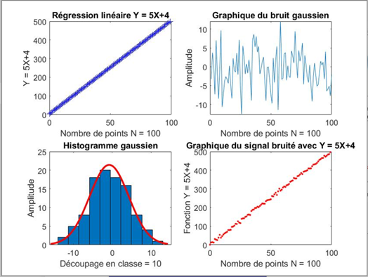
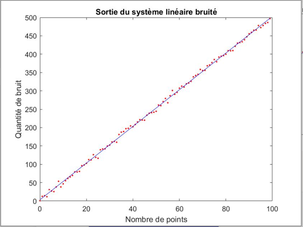
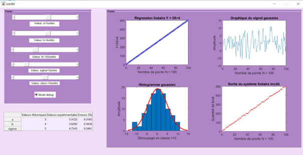

# Realization of an HMI
## Objective of the project
The objective of this project is to build a human-machine interface. This interface will make it possible to visualize the static regression. It will have different data cursors which will be instantiated by the user and which will generate different graphs. The interest of these graphs is to recover values in order to calculate the relative error of a linear system according to the values defined by the user.
## Programming language
* MATLAB

## Simulation
I created a simulation function which allows to display according to the values entered by the user, graphs of this type:
* a linear regression curve
* a Gaussian noise
* a Gaussian histogram
* a noisy signal combined with linear regression

  

## Data extraction
This part consists of extracting the different variables from our simulation function. I created a new function which will take as a parameter: errors.

  

## Results analysis
Modeling part : I was able to perform a simulation of a system whose response is linear thanks to a function allowing to have different parameters chosen by the user through five cursors a, b, N, sigma, class:
-	Linear regression
- Gaussian noise
- Gaussian histogram
- Noisy signal

Noise representation part : I have a graph that displays the noise distribution (in a time domain). I added a slider which is the standard deviation. The evolution of this standard deviation around the mean represents the measurement error.  

Generation part of the values obtained : a table has been inserted which gathers the theoretical and estimated values, as well as their errors.

I generated an initialization file with predefined values so that we could automatically display our graphs when launching the code.  

In the end I have the following graphical interface:

  

## Conclusion
By programming this Human-Machine interface, I obtained different information such as the measurement noise, the coefficient of determination.  

During this project, I used different methods like matrix calculation and least squares method.
